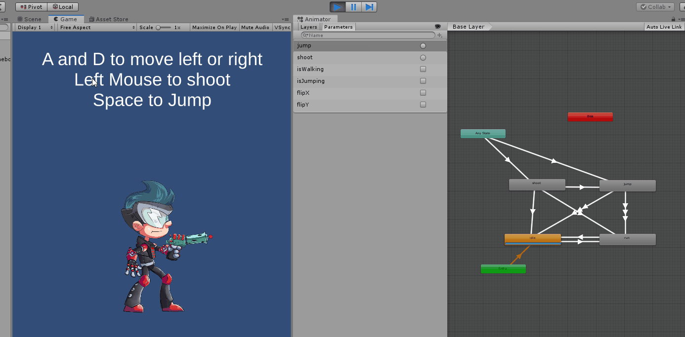
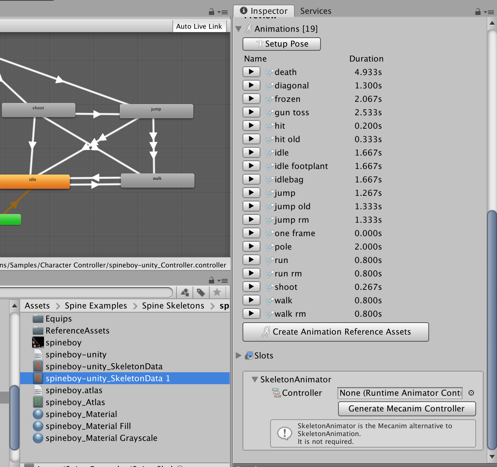
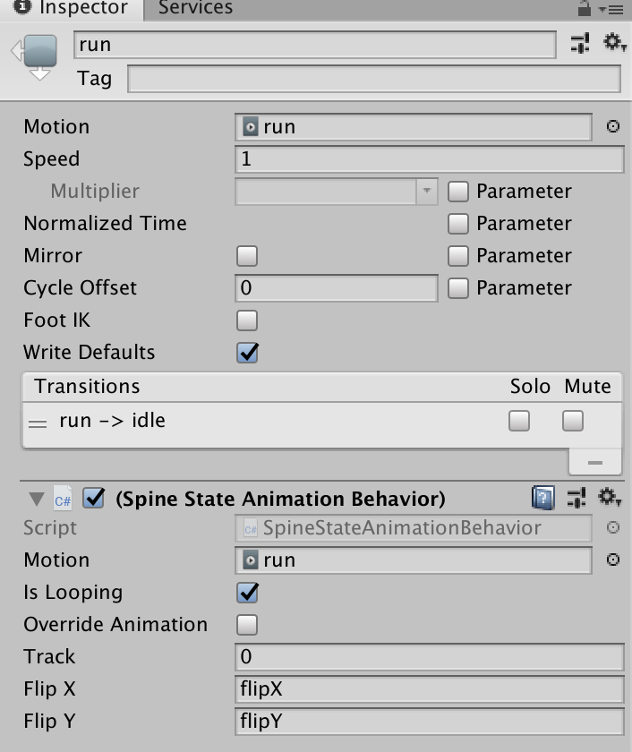

# Spine Extensions (DEPRECATED)
**NOTE** : THIS PROJECT IS DEPRECATED SINCE THE [OFFICIAL SPINE RUNTIME](http://esotericsoftware.com/spine-unity) ALREADY HAS THIS FEATURE.

# Overview

This project contains simple scripts that you can use in your game to integrate spine animations with Unity's mecanim workflow.

# How to use

For this example, I'm going to be using SpineBoy from the Spine2D's [runtime](http://esotericsoftware.com/spine-unity-download).

First, go to your spine skeletondata .asset file and create an animation controller. 

Attach the desired motions to your animation controller. Add the `SpineStateAnimationBehavior` component on the states added. Each property in this component has tooltips which describe their purpose. The most important field on this component is the `motion` field you set, as this will be the animation that will be used to play.

Now you can use the animator parameters to control your spine animations!

I've added another component (`SpineEventsListener.cs`) which you can use to listen to custom spine events in your animations.

## Notes
- When creating transitions from one state to another, ensure that there is **no transition time**. Blending is done by spine's runtime, not the mecanim.
- This method simply uses the mecanim as a visual tool for creating statemachines with your spine animations.

# Sample Usage

Example usage can be found in the `Spine Extensions/Samples/Character Controller`.

# Limitations

While this project leverages Unity3D's mecanim, certain features of spine2d's runtime are not supported (e.g. custom blending, animation queueing). This extension is meant for fairly simple animation state machines.

